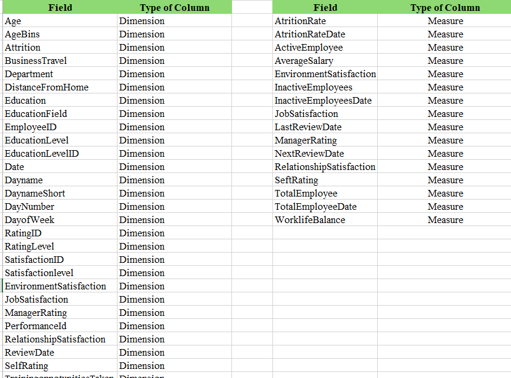
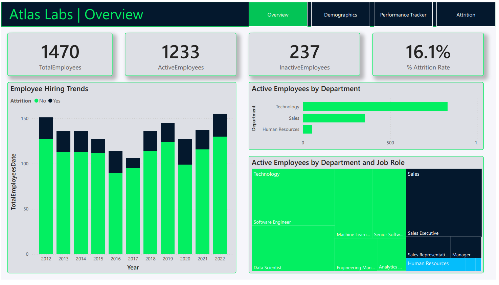

# [POWER BI] HR Analytics 
## I. Introduction
### 1. Introduction to Dataset
* Dataset: **Atlas Labs**
- Dataset describing human resources in Atlas
- Consists of 5 data tables:
  - Table 1: **PerformanceRating**: Fact PerformanceRating
  - Table 2: **Employees**: Information of Employees
  - Table 3: **EducationLevel**: Information of Education 
  - Table 4: **RatingLevel**: Information of Rating level
  - Table 3: **SatisfieldLevel**: Information of Satisfaction
### 2. Data Dictionary

### 3. Business Questions
- The main issue is employee attrition, where employees are leaving the company. 
- The business is investigating the causes and influencing factors to devise retention strategies and keep valuable talent.

## II. Design Thinking Method
**Here are the five steps of design thinking:**
### Step 1 - Empathize
 

### Step 2 - Define

### Step 3 - Ideate

### Step 4 - Prototype

### Step 5 - Review

## III. Visualization
### 1. Overview

### 2. Demographics

### 3. Performance Tracker

### 4. Attrition

## IV. Insights
1, The total number of **active** and **inactive** employees is 1233, 237 respectively.

2, Current employee attrition rate is 16.2%.

3, Over the past 5 years, the attrition rate has gradually increased, especially in **2022** and **2019**.

4, **Technology** is the department with the most active employees, followed by the **Sales department**.

5, **Software Engineer** and **Sales Executive** are the two jobs with the most employees.

6, The largest proportion of employees is between the ages of **20-29**.

7, The proportion of **married and unmarried** employees is quite balanced, 42.45%, 37.35% respectively.

8, The highest salaries belong to **Whites and Native Hawaiians**, the lowest are mixed or multiple ethnic groups.

9, Attrition By:
- Department and JobRole : The attrition rate ranked in order is **Sales - Sale Representative, Human - Resoure Recruiter, Technology- Data** Scientist.
- Travel Frequency: The highest employee attrition rate is for employees who travel frequently;
- Overtime Requirement: Part-time employees have a high attrition rate.
- Tenure: The attrition rate is inversely proportional to the number of years worked.

## V. Recommendations
**Retention Resilience Initiative**

1. ___For Employees:
- Career Development Program: The organization can create training and career development programs to provide advancement opportunities and development for current employees. This can help increase employee commitment and satisfaction, thus reducing attrition rates.
2. ___For Attrition:
- Employee Retention Programs: The organization can design retention programs and strategies, particularly focusing on departments and job positions with high attrition rates such as Sales - Sale Representative, Human Resources Recruiter, and Technology - Data Scientist. This may include improving the work environment, development opportunities, and welfare policies to retain employees.
- Work Time Management and Fixed Work: The organization needs to reconsider overtime requirements and work time for employees, especially for those who work hourly or have frequent overtime demands. This helps reduce job stress and enhances work-life balance, thereby decreasing attrition rates.
- Performance Management Program: The organization needs to establish effective performance management programs, especially to support new employees and those with low tenure. This helps create favorable working conditions and ensures that employees are adequately supported and evaluated.
